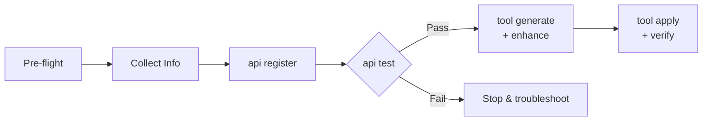

# Skill Usage

bridgectl ships with **AI agent skills** — pre-built workflow definitions that let an AI coding assistant execute multi-step bridgectl tasks autonomously. Skills live in the ERPBridge repository under `skills/` and follow the [Agent Skills Specification](https://agentskills.io/specification).

:::tip When to use a skill
If you are pair-programming with an AI agent (Antigravity, Copilot, Cursor, etc.), point it at the relevant skill file. The agent will follow each step in order, call the right bridgectl commands, and handle errors using the built-in troubleshooting tables.
:::

---

## Bridgectl Add API

| | |
| :--- | :--- |
| **Skill name** | `bridgectl-add-api` |
| **Location** | `skills/bridgectl-add-api/SKILL.md` (in the ERPBridge repo) |
| **Version** | 2.0.0 |
| **Purpose** | Register a new ERP API endpoint and expose it as a callable MCP tool |
| **Prerequisites** | bridgectl CLI, Go 1.26.2+, network access to the target ERP and ERPBridge Management Server |

### What it does

The **bridgectl-add-api** skill automates the full onboarding lifecycle for a new ERP endpoint:

1. **Pre-flight** — verifies the environment, active context, and CLI version
2. **Collect information** — gathers endpoint name, URL, HTTP method, module, description, and auth details
3. **Register the API** — calls [`bridgectl api register`](./bridgectl_api_register.md)
4. **Test connectivity** — calls [`bridgectl api test`](./bridgectl_api_test.md) *(mandatory — workflow stops on failure)*
5. **Generate & enhance schema** — calls [`bridgectl tool generate`](./bridgectl_tool_generate.md), then enriches the YAML with required metadata
6. **Apply & verify** — calls [`bridgectl tool apply`](./bridgectl_tool_apply.md) and [`bridgectl tool describe`](./bridgectl_tool_describe.md) to confirm the tool is live

:::warning
Step 3 (Test Connectivity) is a **hard gate**. If the test fails the agent must stop and resolve the issue before proceeding. Never skip this step.
:::

### Workflow diagram



### Quick example

Below is a condensed version of the commands the agent runs at each step. In practice the agent fills in the placeholder values from context.

```bash title="Step 0 — Pre-flight"
bridgectl version && bridgectl context list && bridgectl doc
```

```bash title="Step 2 — Register the API"
bridgectl api register \
  --name get-purchase-orders \
  --url "http://erp.local:8081/api/purchase-orders" \
  --method GET \
  --module procurement \
  --description "List all purchase orders" \
  --auth-type api-key \
  --auth-key "$ERP_PRIMARY_KEY"
```

```bash title="Step 3 — Test connectivity"
bridgectl api test get-purchase-orders
```

```bash title="Step 4 — Generate schema"
bridgectl tool generate --api get-purchase-orders -o yaml > get-purchase-orders.yaml
```

After generation, the agent **must** enhance the YAML with human-readable metadata:

```yaml title="Required metadata fields"
spec:
  description:
    short: "List all purchase orders from the ERP system"
    whenToUse: "When the user asks for purchase orders, PO lists, or procurement data"
    examples:
      - "Show me all open purchase orders"
      - "List POs from last month"
      - "Get procurement orders for vendor ACME"
```

```bash title="Step 5 — Apply & verify"
bridgectl tool apply -f get-purchase-orders.yaml
bridgectl tool get && bridgectl tool describe get-purchase-orders
```

### Troubleshooting

The skill bundles a troubleshooting reference (`references/TROUBLESHOOTING.md`) with error-to-fix lookup tables for each step:

<details>
<summary>Registration errors (Step 2)</summary>

| Error | Cause | Fix |
| :--- | :--- | :--- |
| `name already exists` | Duplicate API name | Choose a unique name or remove the existing entry |
| `invalid URL format` | Malformed URL | Ensure the URL includes protocol (`http://` or `https://`) |
| `unknown auth-type` | Unsupported auth type | Use `api-key`, `basic`, or `bearer` |
| `permission denied` | Insufficient privileges | Check the active context credentials |

</details>

<details>
<summary>Connectivity errors (Step 3)</summary>

| Error | Cause | Fix |
| :--- | :--- | :--- |
| `connection refused` | ERP server is down or wrong port | Verify the ERP URL and ensure the server is running |
| `401 Unauthorized` | Invalid credentials | Check `--auth-key` value matches the ERP system |
| `403 Forbidden` | Credential lacks required scope | Request broader permissions from the ERP admin |
| `404 Not Found` | Wrong endpoint path | Verify the URL path against the ERP API docs |
| `timeout` | Network issue or slow ERP | Check network connectivity; consider `--timeout` flag |

</details>

<details>
<summary>Schema errors (Step 5)</summary>

| Error | Cause | Fix |
| :--- | :--- | :--- |
| `invalid schema: missing spec.description` | Enhancement step was skipped | Add the required `short`, `whenToUse`, and `examples` fields |
| `tool name conflict` | Tool already exists in registry | Use a different name or delete the existing tool first |
| `mcp server unreachable` | Management Server connection lost | Verify the context URL with `bridgectl context list` |
| `YAML parse error` | Malformed YAML | Validate syntax with `bridgectl tool validate -f <file>` |

</details>

### Skill resources

The skill directory includes these reference files:

| File | Description |
| :--- | :--- |
| `SKILL.md` | Main skill definition with the full workflow |
| `assets/mcp-tool.yaml` | MCP tool schema template |
| `references/COMMANDS.md` | Quick-reference table of all bridgectl commands used |
| `references/TROUBLESHOOTING.md` | Error lookup tables for each workflow step |
