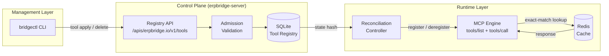
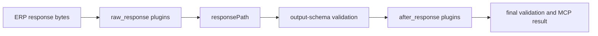
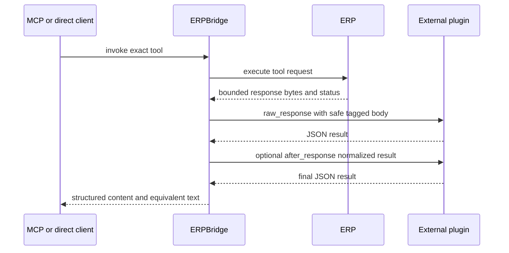
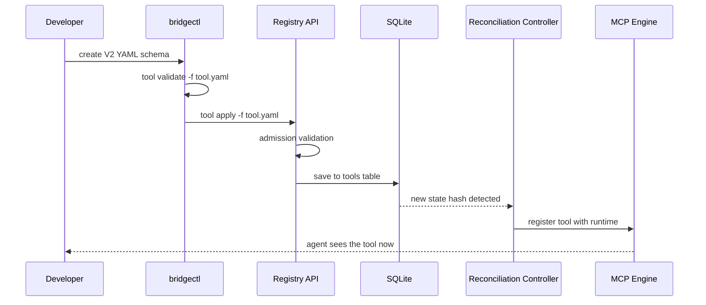

# ERPBridge V2 architecture: declarative control plane

ERPBridge V2 adopts a **Declarative Control Plane** architecture, inspired by Kubernetes. This design moves away from static, file-system-bound configurations toward a live API-managed resource system for MCP tools.

## High-level overview

The system is divided into three distinct layers:

1. **Management Layer (The CLI)**: Developers use `bridgectl` to declare the desired state of the system by "applying" YAML/JSON resource definitions.
2. **Control Plane (The Server)**: A centralized API server stores tool definitions in a persistent SQLite database, validates them against strict admission rules, and manages versioning.
3. **Runtime Layer (MCP Engine)**: A background reconciliation controller keeps the active MCP server aligned with the desired state in the database.

## Endpoint and tool: key concepts

One of the most important concepts in ERPBridge V2 is the distinction between registering an **API Endpoint** and applying an **MCP Tool**.

| Feature | **API Endpoint** (`api register`) | **MCP Tool** (`tool apply`) |
| :--- | :--- | :--- |
| **Mental Model** | Technical Discovery | Declarative Management |
| **Primary Focus** | The ERP System (technical) | The AI Agent (semantic) |
| **Storage** | Context-scoped local registry (`~/.bridgectl/registries/<context>.json`) | Server Registry (`erpbridge.db`) |
| **Visibility** | **Hidden from AI** | **Visible to AI** (as an MCP Tool) |
| **Stability** | Experimental / Internal | Versioned / Stable |
| **Command** | `bridgectl api register ...` | `bridgectl tool apply -f ...` |

### Why separate them?

- **Technical vs. Semantic**: A single ERP API endpoint (e.g., `/api/v1/resource/Employee`) might be used by multiple MCP tools with different filters or versions.
- **Safety**: Registering an API is a developer-only technical step. Applying a tool is a conscious decision to expose functionality to an AI agent.
- **Lifecycle**: You can "discover" and test 100 API endpoints locally, but only "apply" the 5 that are safe and ready for the LLM to use.

## Core components

### 1. Tool resource registry (the source of truth)

Instead of loading files from a directory, the server maintains an internal **Tool Registry** backed by **SQLite**. This registry stores multiple versions of the same tool, allowing for safe rollouts and rollbacks.

Each tool includes an `IsActive` flag. When a tool is "deleted" via the CLI, it is not immediately purged from the database. Instead, it is marked as `IsActive = false`. This "soft-delete" pattern allows the system to manage visibility without breaking existing MCP sessions.

### 2. Version resolver

When an AI agent requests a tool (e.g., `list_employees`), the **Version Resolver** automatically selects the **latest stable version** (e.g., `list_employees@1.2.0`). It explicitly ignores any tools marked as inactive.

### 3. Visibility filtering (JSON-RPC interception)

Because the underlying MCP runtime does not always support dynamic removal of tools from an active session, ERPBridge implements a **Visibility Filtering Layer**.

- **The Problem**: Once a tool is registered in memory, standard libraries often provide no way to "unregister" it without a restart.
- **The Solution**: ERPBridge wraps the MCP server's HTTP handler and intercepts the `tools/list` response. Before the JSON-RPC result reaches the client, ERPBridge parses the list and removes any tools marked as `IsActive = false` in the internal registry.
- **Result**: The client receives a truthful list of tools. The list matches the desired state of the control plane. This works even when the underlying runtime still knows the "ghost" tools.

### 4. Reconciliation controller

The server runs a background reconciliation controller. It keeps the in-memory MCP registry in sync with the SQLite database.

The controller runs every 10 seconds. It compares the database state against the desired state:

- If a tool exists in SQLite but not in the registry, the controller registers it.
- If a tool is inactive (soft-deleted) or missing from SQLite, the controller deregisters it from the MCP runtime.
- If a tool changes, the controller re-registers the new version.

Each check uses a SHA-256 state hash over ordered tool, plugin, and binding identity, activity, update timestamp, and stored resource data. If the hash is unchanged, the controller skips the pass. This keeps the check cheap.

When the registry changes, the controller sends the `notifications/tools/list_changed` notification to all active MCP sessions.

The controller also runs immediately after a `tool apply` HTTP request. The tool is visible to agents right after apply. It does not wait for the next 10-second tick.

## External response plugins

ERPBridge invokes an externally operated HTTP plugin. The control plane stores
the endpoint and exact release, but never installs, starts, upgrades, or
schedules plugin code.

A `PluginBinding` connects one exact plugin version to one exact tool version.
A `raw_response` binding runs first and receives a bounded ERP response with
status, normalized content type, and a tagged JSON or base64 body. It can adapt
media, such as an ERP image to OCR text. The plugin cannot change status or
receive ERP headers, URLs, credentials, caller identity, or original arguments.
The developer owns the final object-shaped MCP output schema; plugins never
change it dynamically. An incompatible output meaning requires a new
MCP-visible tool name and exact tool version.

For successful responses, the fixed order is:

Terminal non-2xx responses can be inspected by raw plugins while retaining ERP
retry and circuit-breaker accounting. They remain errors, including 3xx, and
skip success-only normalization and after-response processing.

The pipeline runs only on cache misses. The cache stores the final transformed
MCP result and never stores an error result, so cache hits bypass ERP and
plugins. Plugin or binding lifecycle changes flush affected tool cache entries.
`continue` uses the original captured response only when it satisfies the final
schema; otherwise it returns a safe error. Use `fail` for media conversion
unless a compatible fallback is known.

Plugin resources support `api` and `docker` metadata types; both describe an
external deployment. ERPBridge does not own plugin images or their lifecycle.
Credentialed calls support bearer and API-key headers only. A `credentialRef`
is an environment-variable name with a `PLUGIN_` prefix; the resolved value is
read at request time and is never persisted or logged. Credentialed endpoints
require HTTPS, except for exact development-only `host:port` entries in
`INSECURE_AUTH_ALLOWED_HOSTS`, and exact endpoint admission in
`PLUGIN_ENDPOINT_ALLOWLIST`. Raw bindings require the allowlist even without
plugin authentication, plus authenticated admin admission and an explicit
object-shaped tool schema. Redirects, URL userinfo, raw secrets, and broad
wildcards are not accepted.

## Tool generation and templating

ERPBridge uses a "Template-Based Generation" approach. When generating tools (especially in bulk from OpenAPI):

1. **The Template**: A `Registered API` acts as the source of technical truth (URL, Auth, Module).
2. **The Spec**: An `OpenAPI Definition` acts as the source of semantic truth (Paths, Parameters, Descriptions).
3. **The Result**: The generator merges these, creating production-ready MCP tools that are pre-configured with your environment's connectivity and security settings.

Use the same OpenAPI specification to generate tools for different environments (Dev, Staging, Prod). Point the generator to a different registered API.

Generation is pure until an explicit output or apply operation. The reviewed
manifest under `manifests/<module>/` is the single applied source; generated
YAML is a temporary draft and does not create a competing `schemas/` tree or
per-tool JSON authority. CLI control-plane calls use the configured host root;
only the exact `/mcp` or `/mcp/` transport suffix is normalized away. The
`/mcp/` endpoint itself remains the Streamable HTTP MCP transport.

## Lifecycle of a tool change

1. **Define**: Developer creates a V2 YAML schema for a new tool.
2. **Validate**: Runs `bridgectl tool validate -f tool.yaml` to check for syntax and admission rules (e.g., no raw secrets).
3. **Apply**: Runs `bridgectl tool apply -f tool.yaml`.
4. **Store**: The ERPBridge API validates the payload again and saves it in the SQLite `tools` table.
5. **Reconcile**: The background controller detects the new DB entry and registers it with the `mcp-go` runtime.
6. **Execute**: AI agents now see the new tool and can invoke it immediately.

## Security design

- **Secret decoupling**: Schemas and plugin resources never contain raw tokens or keys. They contain only a `credentialRef`; the middleware resolves it from the environment at request time. Legacy local API registries require an explicit scrub before state changes continue.
- **Transport Admission**: Credentialed ERP and plugin endpoints require HTTPS, except exact development-only `host:port` entries. Plugin endpoints also require exact `PLUGIN_ENDPOINT_ALLOWLIST` membership. Userinfo and redirects cannot be used to bypass the policy.
- **Admission Controllers**: The API server rejects suspicious endpoint content, unknown authentication fields, reserved headers, raw-secret-looking values, and invalid credential references.
- **Redaction**: All logs produced by tool executions are automatically filtered to redact sensitive keys defined in `internal/types/sensitive.go`; ERP request and response bodies are not logged.
- **Deployment Boundary**: ERPBridge stores plugin configuration and invokes the protocol, but does not install, start, update, or schedule plugin code.
- **Structured failures**: Control-plane HTTP errors use bounded `error`,
  `message`, `suggestion`, and numeric `code` fields. Stable identifiers such
  as `VALIDATION_FAILED`, `AUTHORIZATION_DENIED`, `UPSTREAM_UNREACHABLE`, and
  `API_PROBE_FAILED` provide recovery keys without exposing upstream bodies.
- **Sensitivity admission**: Tools may declare `security.dataClass` as
  `public`, `internal`, `pii`, or `restricted`; the latter two require opaque
  `allowedRoles`. Development-only `system.*_test` tools are gated, and
  RedisInsight is loopback-only by default.